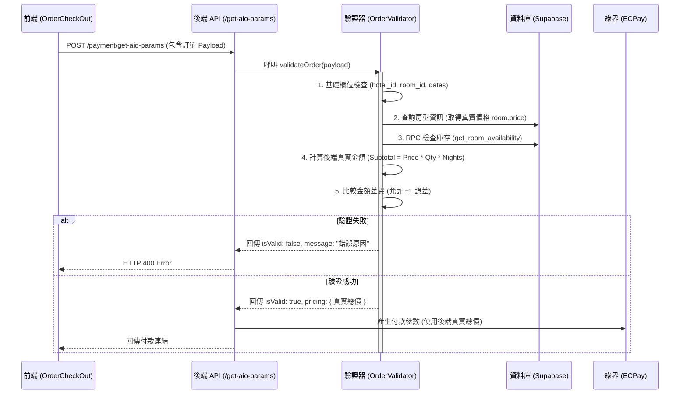

# 後端訂單驗證流程文檔 (Backend Order Validation)

本文檔詳細說明 WanTrip 系統的後端訂單驗證機制，該機制旨在確保所有交易的數據完整性與安全性，防止價格篡改與庫存超賣。

## 1. 系統架構

驗證流程發生在前端送出結帳請求、系統導向 ECPay 綠界付款之前。



## 2. 驗證細節

驗證服務位於 `src/services/OrderValidator.ts`，主要執行以下五大檢查：

### 2.1 必填欄位檢查

確保請求包含所有建立訂單的必要資訊：

- `hotel_id`: 飯店 ID
- `room_id`: 房型 ID (若缺失將無法進行後續嚴格驗證)
- `checkInDate` / `checkOutDate`: 入住與退房日期

### 2.2 房型與價格驗證 (Source of Truth)

系統不信任前端傳來的單價。

- **操作**：使用 `room_id` 從資料庫查詢最新的 `price`。
- **目的**：防止駭客透過攔截封包修改單價（例如將 $5000 改為 $1）。

### 2.3 庫存檢查 (Inventory Check)

- **操作**：呼叫資料庫 RPC 函式 `get_room_availability`。
- **邏輯**：計算指定日期區間內的剩餘房間數。
- **條件**：若 `剩餘庫存 < 訂購數量`，則拒絕交易。
- **目的**：防止超賣。

### 2.4 真實金額計算

後端根據資料庫查到的資訊重新計算應付金額：

1.  **小計** = 真實單價 × 房間數 × 天數
2.  **長住優惠** (若啟用) = 依天數計算折扣 (目前設定為 0 以配合前端)
3.  **總價** = 小計 - 優惠折扣

### 2.5 最終比對與修正

- **比對**：將「前端傳送的總金額」與「後端計算的總金額」進行比對。
- **嚴格模式**：若差異超過 1 元，視為驗證失敗，回傳錯誤訊息 `金額已更新 (系統: xxx, 提交: xxx)`。
- **強制修正**：即使驗證通過，送往綠界的金額也會強制使用**後端計算的真實總價**。

## 3. 安全性測試結果

我們已通過 E2E 自動化測試驗證了以下攻擊場景：

| 測試場景     | 攻擊手法           | 預期結果 | 實際結果                  |
| :----------- | :----------------- | :------- | :------------------------ |
| **價格篡改** | 將總金額改為 $1    | **攔截** | ✅ 成功攔截，拒絕建立訂單 |
| **過期庫存** | 購買 2025 年的空房 | **攔截** | ✅ 成功攔截，提示庫存不足 |
| **計算錯誤** | 前端少算 $100      | **攔截** | ✅ 成功攔截，提示金額不符 |
| **正常交易** | 資料完全正確       | **通過** | ✅ 驗證通過，產生付款連結 |

## 4. 錯誤處理

若驗證失敗，API 會回傳標準的 JSON 錯誤格式，前端可直接顯示 `message` 給用戶：

```json
{
  "success": false,
  "message": "金額已更新 (系統: 30000, 提交: 1)，請重新確認"
}
```
